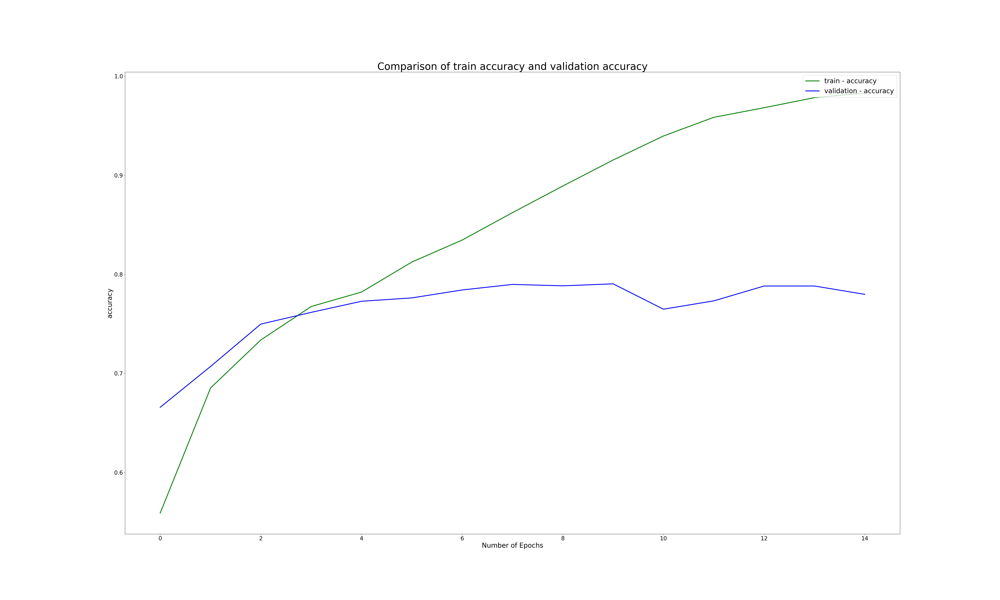
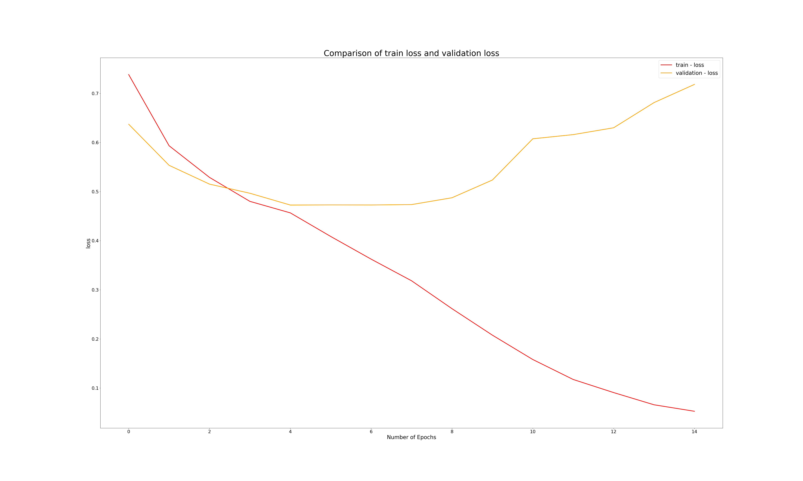
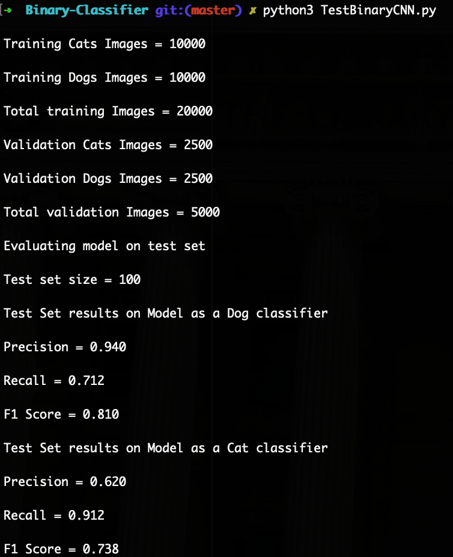
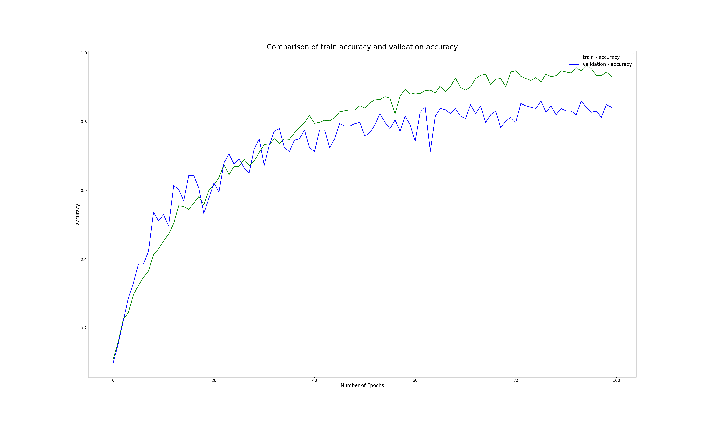
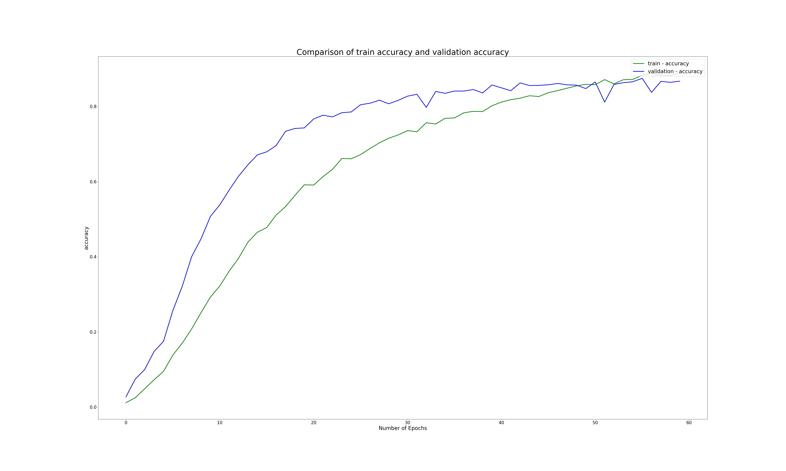
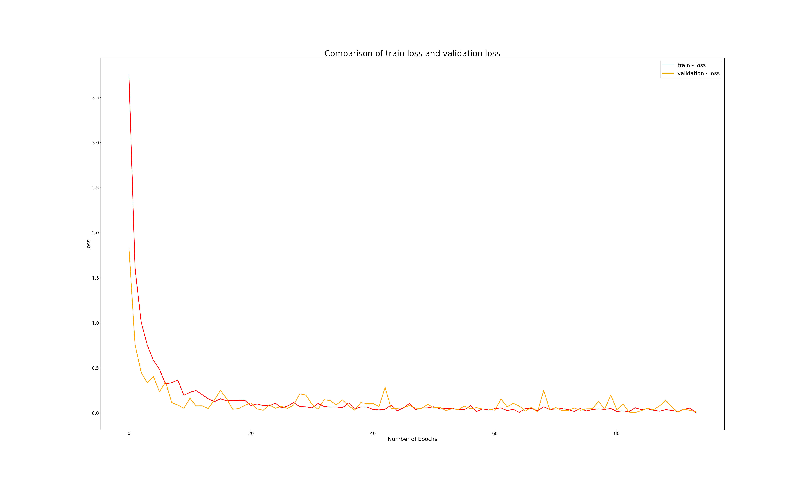

# Image-Classifier-Models-using-TensorFlow
Image classification models on various datasets using TensorFlow and Keras

**Contents**
- About
- Models
  1. Binary-Classifier
    - Dataset
    - Classes
    - Executables
    - Results
  2. Multi-Classifier
    - Dataset
    - Classes
    - Executables
    - Results
  3. Multi-Classifier-with-Transfer-Learning
    - Dataset
    - Classes
    - Executables
    - Results
- Conclusions

**About** 
I have undertaken this project to demonstrate my interpretation of Image Classifiers. I have built three Image classifiers (Binary-Classifier, Multi-Classifier and Multi-Classifier-with-Transfer-Learning) and trained them on opensource datasets from kaggel dot com. I have used TensorFlow 2.0 to build these classifiers. The build design is object oriented containing several classes. The executable code to train and test the models is written as a script.

My conclusions from each model are at the end.

**Models**
1. **Binary-Classifier:**
  - **Dataset**
    - [cats_and_dogs](https://www.kaggle.com/greg115/cats-and-dogs)
      1. Training Set Size = 20000 (cats = 10000, dogs = 10000)
      2. Validation Set Size = 5000 (cats = 2500, dogs = 2500)
      3. Test Set Size = 100 (mixed)
    - The mixed test set is preprocessed into cats and dogs classes prior to using the dataset
  - **Classes**
    - BinaryCNN : model class for the convolutional neural network binary classifier
    - BinaryImageGenerator : ImageDataGenerators for flowing the images to the model from dataset
    - DatasetDirectoryPreprocessing : Initializing and logging directories of datasets
    - PlotCode : Plotting metrics from the trained model
  - **Executables**
    - TrainBinaryCNN : Training the BinaryCNN model using data generators from BinaryImageGenerator on the cats_and_dogs dataset
      - Model Parameters used in training
        1. input shape = (150, 150, 3)
        2. First Convolutional layer: filters = 64, filter_shape = (3, 3), activation = 'relu'
        3. Second Convolutional layer: filters = 64, filter_shape = (3, 3), activation = 'relu'
        4. Dropout layer: dropout fraction = 0.4
        5. Fully connected hidden layer: neurons = 256, activation = 'relu'
        6. Output layer: output neurons = 1, output activation = 'sigmoid'
    - TestBinaryCNN : Testing the trained BinaryCNN model on test dataset
  - **Results**
    - Accuracy of the Binary Classifier on Training and Validation set
    - 
    - Loss of the Binary Classifier on Training and Validation set
    - 
    - Results of the trained model on test set
      - Scores of model as a Cat classifier
        1. Precision = 0.620 
        2. Recall = 0.912
        3. F1 Score = 0.738
      - Scores of model as a Dog classifier
        1. Precision = 0.940 
        2. Recall = 0.712
        3. F1 Score = 0.810
      - 
   
2. **Multi-Classifier:**
  - **Dataset**
    - [Monkey-Species](https://www.kaggle.com/slothkong/10-monkey-species?)
      1. Training Set Size = 1098 (spread across all 10 classes)
      2. Validation Set Size = 272 (spread across all 10 classes)
    - [Testing Dataset](https://github.com/gauravpatil123/Image-Classifier-Models-using-TensorFlow/tree/working/Multi-Classifier/data/testing)
      1. Testing Set Size = 30 (3 images of each class)
  - **Classes**
    - MultiCNN : model class for the convolutional neural network multi classifier
    - MultiImageGenerator : ImageDataGenerators for flowing the images to the model from dataset
    - DatasetDirectoryPreprocessing : Configuring the directories and processing the dataset
    - PlotCode : Plotting metrics from the trained model
  - **Executables**
    - TrainMultiCNN : Training the MultiCNN model using data generators from MultiImageGenerator on the Monkey-Species dataset
      - Model Parameters used in training
        1. input shape = (300, 300, 3)
        2. First Convolutional layer: filters = 32, filter shape = (3, 3), activation = 'relu'
        3. Second Convolutional layer: filters = 64, filter shape = (3, 3), activation = 'relu'
        4. Third Convolutional layer: filters = 64, filter shape = (3, 3), activation = 'relu'
        5. Fourth Convolutional layer: filters = 128, filter shape = (3, 3), activation = 'relu'
        6. Fifth Convolutional layer: filters = 128, filter shape = (3, 3), activation = 'relu'
        7. Dropout layer: dropout fraction = 0.3
        8. First fully connected hidden layer: neurons = 512, activation = 'relu'
        9. Second fully connected hidden layer: neurons = 512, activation = 'relu'
        10. Output layer: output units = 10, activation = 'softmax'
    - TestMultiCNN : Testing the trained MultiCNN model on the Testing Dataset
  - **Results**
    - Accuracy of Multi Classifier on Training and Validation set 
    - 
    - Loss of Multi Classifier on Training and Validation set
    - 
  
3. **Multi-Classifier-with-Transfer-Learning:**
  - **Dataset**
    - [Monkey-Species](https://www.kaggle.com/slothkong/10-monkey-species?)
      1. Training Set Size = 1098 (spread across all 10 classes)
      2. Validation Set Size = 272 (spread across all 10 classes)
    - [Testing Dataset](https://github.com/gauravpatil123/Image-Classifier-Models-using-TensorFlow/tree/working/Multi-Classifier-with-Transfer-Learning/data/testing)
      1. Testing Set Size = 30 (3 images of each class)

  - **Classes**
    - PreTrainedInceptionV3 : importing and loading the pre-trained weights from the InceptionV3 model from keras.applications and configuring the model
    - MultiCNN : configuring a model by adding Dense and output layers at the bootom of the pre-trained model
    - ImageGenerators : ImageDataGenerators for flowing theimages to the model from dataset
    - DatasetDirectoryPreprocessing : Directories, processing and splitting of dataset in to training, validation and test sets
    - PlotCode : Plotting metrics from the trained model
  - **Executables**
    - TrainMultiCNN : Training the neural network using data generators from ImageGenerators on the Monkey-Species dataset
    - TestMultiCNN : Testing the MultiCNN model on the Testing Dataset
  - **Results**
    - Accuracy of the classifier on Training and Validation set
    - 
    - Loss of the classifier on Training and Validation set
    - 

**Conclusions**
1. Training the Binary-Classifier just for 15 epochs on the dataset is enough for this model to reach a very high train accuracy >98% and high validataion accuracy ~80%. I have achieved these results by adding two convolutional layers in the model and then used a dropout layer to regularize the neural network and to apply pruning to the model to avoid the problems of overfitting. 
I have also appied data augmentation techniques to generate synthetic data to add variety to the training dataset and improve the learning. The model classifies well on unseen cats and dogs images due to the application of the mentioned techiques.
2.##
