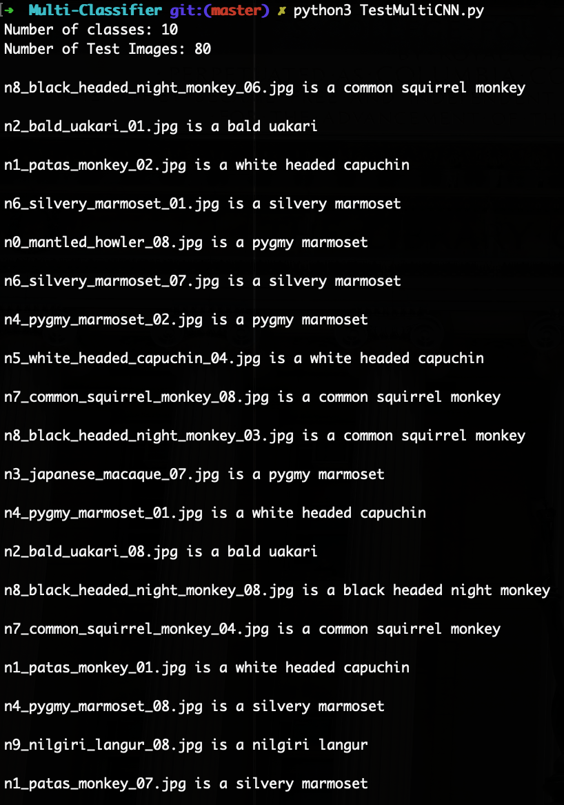

# Image-Classifier-Models-using-TensorFlow
Image classification models on various datasets using TensorFlow and Keras

**Contents**
- About
- Conclusions
- Models
  1. Binary-Classifier
    - Dataset
    - Classes
    - Executables
    - Results
  2. Multi-Classifier
    - Dataset
    - Classes
    - Executables
    - Results

**About** 
I did this project to demonstrate my interpretation of Image Classifiers. I have built two Image classifiers (Binary-Classifier and Multi-Classifier) and trained them on opensource datasets from kaggel dot com. I have used TensorFlow 2.0 to build these classifiers. The build design is object oriented containing several classes. The executable code to train and test the models is written as a script.

**Conclusions**
1. The Binary classifier model has achieved high learning rate and accuracy owing to the better feature extraction from the two consecuting convolutional-maxpool layer blocks. Additionally the use of dropout layer prunes the neural network of access redundant features and avoids the problem of overfitting, dropout layer also solves the problem of exploding and vanishing gradients. I have also appied data augmentation techniques to generate synthetic data to add variety to the training dataset and improve the learning. Training this Binary-Classifier just for 15 epochs on the dataset is enough for the model to reach a very high train accuracy >98% and high validataion accuracy ~80%.
2. The Binary model classifies well on unseen cats and dogs images due to the application of the methods mentioned in conclusion point 1. Hence the resulting F1 Score is high for the trained Classifier model (0.81 for classifying dog images, 0.738 for classifying cat images)
3. Eventhough the dataset used in Multi-Classifier model for training and validation is very small having only 1370 images spread over 10 classes the Multi-Classifier model yields 60% accuracy on unseen test images. To yield a better accuracy we need to increase the size of the dataset for training and validation to avoid quick overfitting on the dataset.

**Models**
1. **Binary-Classifier:**
  - **Dataset**
    - [cats_and_dogs](https://www.kaggle.com/greg115/cats-and-dogs)
      1. Training Set Size = 20000 (cats = 10000, dogs = 10000)
      2. Validation Set Size = 5000 (cats = 2500, dogs = 2500)
      3. Test Set Size = 100 (mixed)
    - The mixed test set is preprocessed into cats and dogs classes prior to using the dataset
  - **Classes**
    - BinaryCNN : model class for the convolutional neural network binary classifier
    - BinaryImageGenerator : ImageDataGenerators for flowing the images to the model from dataset
    - DatasetDirectoryPreprocessing : Initializing and logging directories of datasets
    - PlotCode : Plotting metrics from the trained model
  - **Executables**
    - TrainBinaryCNN : Training the BinaryCNN model using data generators from BinaryImageGenerator on the cats_and_dogs dataset
      - Model Parameters used in training
        1. input shape = (150, 150, 3)
        2. First Convolutional layer: filters = 64, filter_shape = (3, 3), activation = 'relu'
        3. Second Convolutional layer: filters = 64, filter_shape = (3, 3), activation = 'relu'
        4. Dropout layer: dropout fraction = 0.4
        5. Fully connected hidden layer: neurons = 256, activation = 'relu'
        6. Output layer: output neurons = 1, output activation = 'sigmoid'
    - TestBinaryCNN : Testing the trained BinaryCNN model on test dataset
  - **Results**
    - Accuracy of the Binary Classifier on Training and Validation set
    - 
    - Loss of the Binary Classifier on Training and Validation set
    - 
    - Results of the trained model on test set
      - Scores of model as a Cat classifier
        1. Precision = 0.620 
        2. Recall = 0.912
        3. F1 Score = 0.738
      - Scores of model as a Dog classifier
        1. Precision = 0.940 
        2. Recall = 0.712
        3. F1 Score = 0.810
      - 
   
2. **Multi-Classifier:**
  - **Dataset**
    - [Monkey-Species](https://www.kaggle.com/slothkong/10-monkey-species?)
      1. Training Set Size = 1098 (spread across all 10 classes)
      2. Validation Set Size = 272 (spread across all 10 classes)
    - [Testing Dataset](https://github.com/gauravpatil123/Image-Classifier-Models-using-TensorFlow/tree/working/Multi-Classifier/data/testing)
      1. Testing Set Size = 80 (8 images of each class)
      2. This testing dataset is self curated by downlaoding images from the web for all the classes. 
  - **Classes**
    - MultiCNN : model class for the convolutional neural network multi classifier
    - MultiImageGenerator : ImageDataGenerators for flowing the images to the model from dataset
    - DatasetDirectoryPreprocessing : Configuring the directories and processing the dataset
    - PlotCode : Plotting metrics from the trained model
  - **Executables**
    - TrainMultiCNN : Training the MultiCNN model using data generators from MultiImageGenerator on the Monkey-Species dataset
      - Model Parameters used in training
        1. input shape = (300, 300, 3)
        2. First Convolutional layer: filters = 32, filter shape = (3, 3), activation = 'relu'
        3. Second Convolutional layer: filters = 64, filter shape = (3, 3), activation = 'relu'
        4. Third Convolutional layer: filters = 64, filter shape = (3, 3), activation = 'relu'
        5. Fourth Convolutional layer: filters = 128, filter shape = (3, 3), activation = 'relu'
        6. Fifth Convolutional layer: filters = 128, filter shape = (3, 3), activation = 'relu'
        7. Dropout layer: dropout fraction = 0.3
        8. First fully connected hidden layer: neurons = 512, activation = 'relu'
        9. Second fully connected hidden layer: neurons = 512, activation = 'relu'
        10. Output layer: output units = 10, activation = 'softmax'
    - TestMultiCNN : Testing the trained MultiCNN model on the Testing Dataset
  - **Results**
    - Accuracy of Multi Classifier on Training and Validation set 
    - 
    - Loss of Multi Classifier on Training and Validation set
    - 
    - Results of the trained model on test set
      - Accuracy of the Model on Test set = 60%
      - 
      - Verbose examples of test results
      - 
